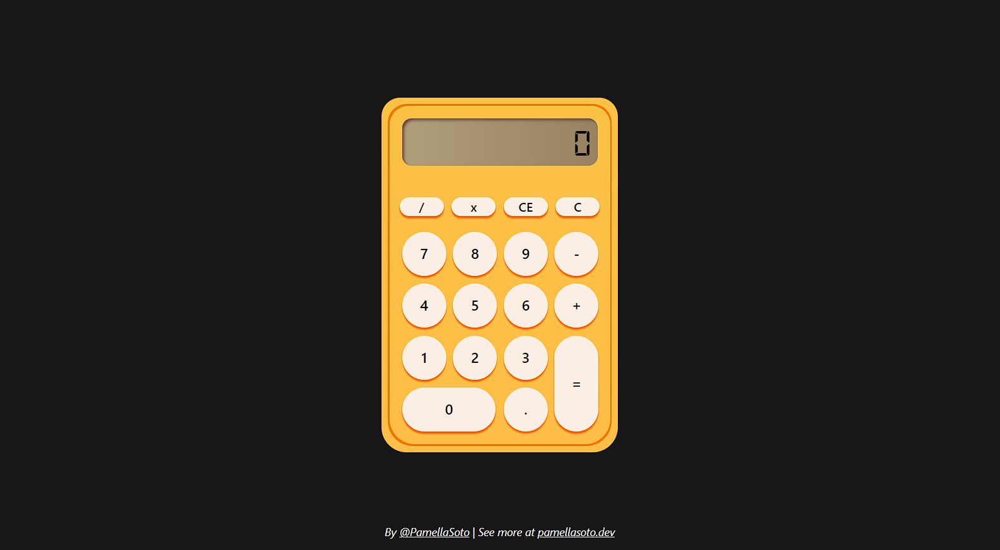

# 🧮 Calculator
Calculator is a simple **React-based calculator** that supports basic arithmetic operations with a finished and ready-to-use UI.

This is an independent mini-project that is also part of my *WIP project* called **Modular Utils.**

All modules can be used **standalone**, but they were designed to also work together inside **Modular Utils as a collection of utilities.**

## 🚀 Features
- Basic arithmetic operations: addition, subtraction, multiplication, and division.  
- Component-based structure for buttons, display, and layout.  
- State management with **React Hooks** (`useState`).  
- Passing values and functions through **props**.  

## 🛠️ Tech Stack
- [React](https://react.dev/)  
- JavaScript (ES6+)  
- [TailwindCSS](https://tailwindcss.com/)

## 📂 Other modules from Modular Utils
- 
- 

## ✅ Checklist
- [ ] Add advanced operations (power, square root, percentage).
- [ ] Create unit tests.
- [ ] Prepare component for integration in Modular Utils.
- [ ] Improve accessibility (keyboard shortcuts, ARIA labels).
